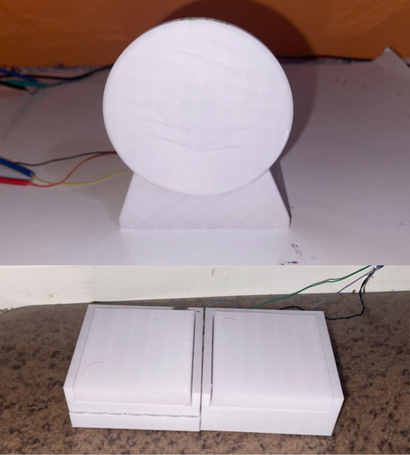
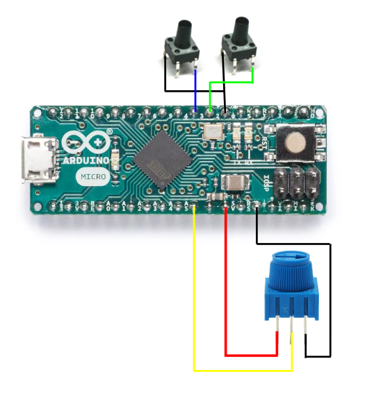

# Arduino Racing Controller
An Arduino Pro Micro project using 3D-printed mechanisms and custom electronics for computer driving control.

## Overview
This project uses 3D printed components and several circuits to make a simple extension for a computer. It can be powered and used with just a USB cable connected to your device. This project makes driving games feel more realistic and more enjoyable.

## Demo
Work in Progress

## Features
 - Potentiometer based steering wheel with adjustable sensitivity and a wide range
 - Accelerator and Brake pedals designed to be easy to push with little force
 - Custom 3D printed pieces
 - Arduino Pro Micro acting as an HID controller

## Hardware
 - Arduino Pro Micro
 - Potentiometer
 - Pushbutton (x2)
 - 3D Printed Components
 - Wiring

## Wiring Diagram

  

## Software
[View the Arduino code](Code/driving_simulator_code.ino)
The code for this program is relatively simple. When the Arduino detects a button press, they press "w" or "s" based on whether the Accelerator or Brake was pressed. The steering works through a potentiometer with a range of 0-1023. The center is 512 and the OneWayRange variable can be increased or decreased to change the amount of space where the steering wheel activates neither left nor right. Decreasing the OneWayRange will make the driving much more sensitive to small changes in angle. Using these values, I programmed the Arduino to activate left when it was at least the value of the OneWayRange variable below 512 and to activate right when it was that same distance above 512.

## Project Structure
 - "CAD/" - STL Files for all 3D printed components
 - "Code/" - Contains the Arduino source code
 - "Images/" - Pictures of every piece before and after assembly
 - "Wiring/" - Contains the wiring diagram

## Assembly
[View the full Assembly Instructions](ASSEMBLY.md)
